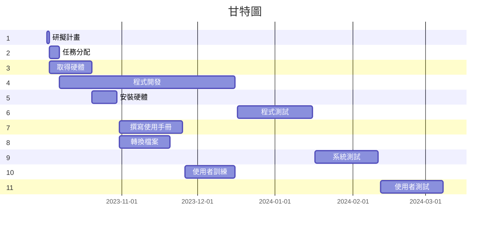
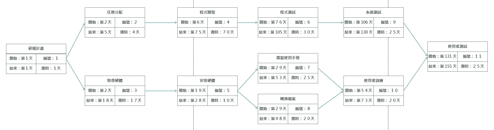

# 甘特圖 ( Mermaid )

```mermaid
gantt
    title 甘特圖

    section 1
    研擬計畫           :a1, 2023-10-02, 1d

    section 2
    任務分配      :2023-10-03  , 4d

    section 3
    取得硬體           :a1, 2023-10-03, 17d

    section 4
    程式開發           :a1, 2023-10-07, 70d

    section 5
    安裝硬體           :a1, 2023-10-20, 10d

    section 6
    程式測試           :a1, 2023-12-17, 30d

    section 7
    撰寫使用手冊           :a1, 2023-10-31, 25d

    section 8
    轉換檔案           :a1, 2023-10-31, 20d

    section 9
    系統測試           :a1, 2024-01-17, 25d

    section 10
    使用者訓練           :a1, 2023-11-26, 20d

    section 11
    使用者測試           :a1, 2024-02-12, 25d
```

# PERT圖

# 關鍵路徑：1→2→4→6→9→11
